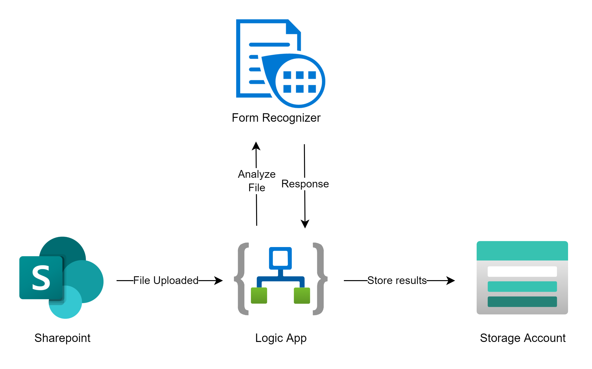
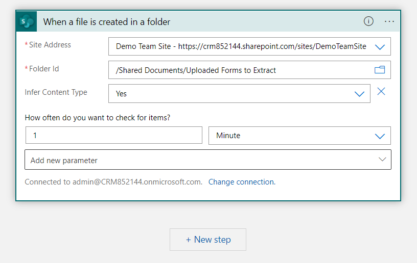
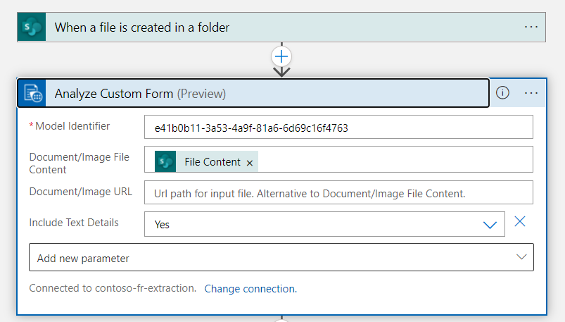
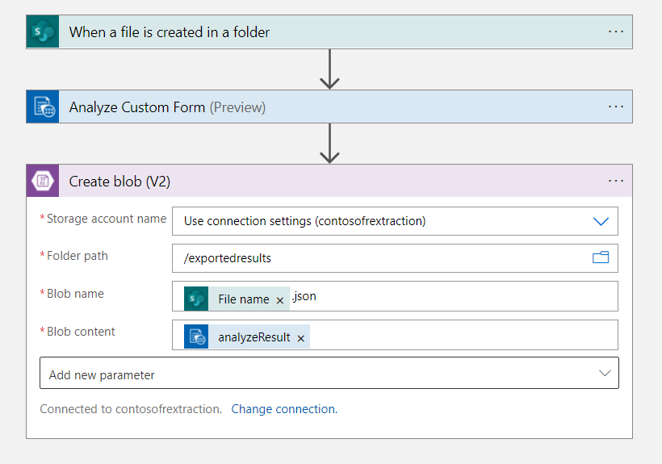

# Extract data from forms automatically using Azure Form Recognizer and Azure Logic Apps

This project demonstrates how to create a process that automatically extracts information from forms using [Azure Form Recognizer](https://azure.microsoft.com/en-us/services/form-recognizer/) and [Azure Logic Apps](https://azure.microsoft.com/en-us/services/logic-apps/). 

## How it works:

1. When a file is uploaded to a Sharepoint folder, an Azure Logic App is triggered. 
2. The Logic App will call Form Recognizer to analyze the form (in this case, using a [custom model of  Azure Form Recognizer](https://docs.microsoft.com/en-us/azure/applied-ai-services/form-recognizer/concept-custom)). The same can be done with the default Layout or Document APIs from Form Recognizer.
3. The Logic App will store the results of the Form Recognizer in Blob storage, where they can be used by another application or process.

## Get Started

1. **Create Sharepoint Site**
2. **Deploy Azure Resources**

    Option 1: 

    

    Option 2: Step-by-step process
    1. Create a Logic App
    2. Create a Form Recognizer resource. Note that we will opt for v2.1 of the Form Recognizer as it is the latest General Availability and the Logic App connector we will use has been built for v2.1. If you plan on using a custom model (as I am doing here), follow the [steps documented in the Microsoft Docs](https://docs.microsoft.com/en-us/azure/applied-ai-services/form-recognizer/quickstarts/try-sample-label-tool)
    3. Create a Storage Account. Within the Storage Account, create 2 containers, one for training documents to train the Form Recognizer Custom Model (ex: trainingdocuments) and another container for the export from Logic App (ex: exportedresults)
3. **(If you are planning to use a Form Recognizer custom model) Train your custom model using at least 5 documents**
4. **Configure your Logic App**
    1. Select the Sharepoint connector `When a file is created in a folder`. 
        1. Configure your Sharepoint connection by logging in
        2. Configure the Trigger action as follows, replacing values for your own:
    
    2. Add a Form Recognizer action `Analyze Custom Form`.  
        1. Configure your connection to the Form Recognizer resource using the Form Recognizer keys and endpoint. 
        2. Configure the `Analyze Custom Form` action to pass the `File Content` from the previous step.
        
    3. Add a Blob Storage action `Create blob (V2)`. 
        1. Configure your connection to the Storage account using the Storage account access keys (or managed identity if you prefer). 
        2. Configure the `Create blob (V2)` action passing the Blob content as the analyzeResult from the above `Analyze Custom Form` action. 
        

